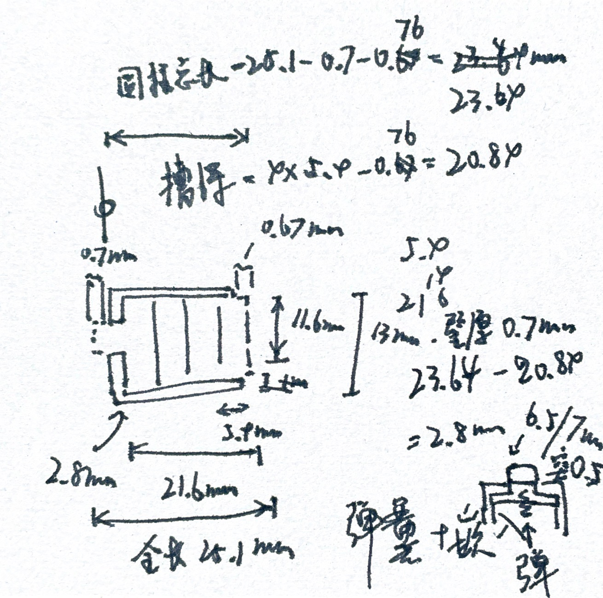
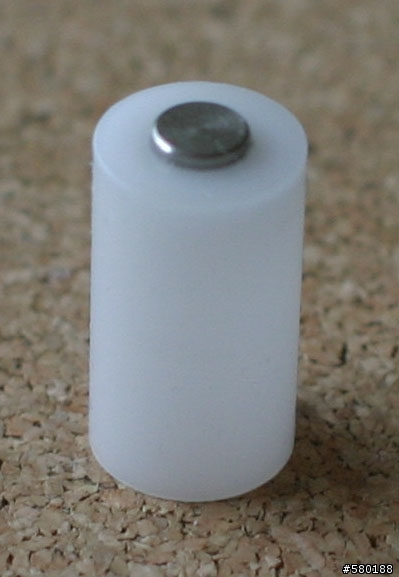
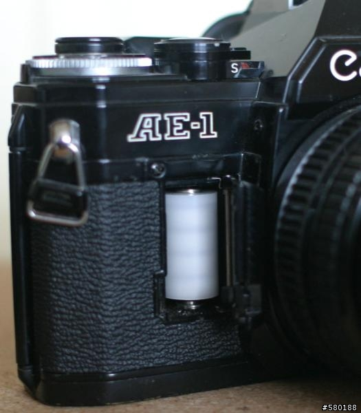
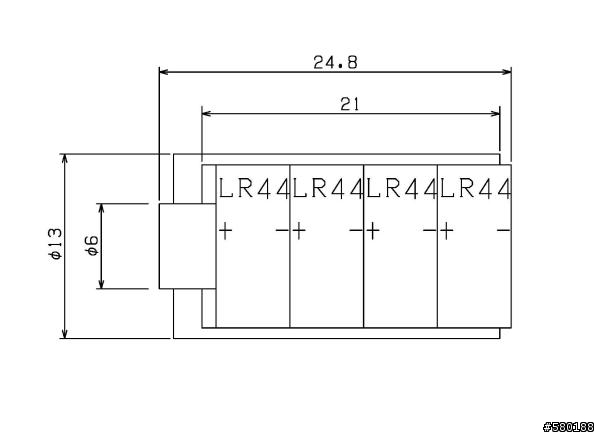

# LR44 to 4LR44 Converter

This is a converter for using 4 LR44 batteries instead of a 4LR44 battery due to the unavailability of 4LR44 batteries. It is designed to be 3D printed.

- [LR44_TO_4LR44_CONVERTER.FCStd](./LR44_TO_4LR44_CONVERTER.FCStd) - FreeCAD file
- [LR44_TO_4LR44_CONVERTER-套筒_树脂_3D打印.stl](./LR44_TO_4LR44_CONVERTER-套筒_树脂_3D打印.stl) - STL file for plastic battery sleeve
- [LR44_TO_4LR44_CONVERTER-顶帽_不锈钢_CNC.step](./LR44_TO_4LR44_CONVERTER-顶帽_不锈钢_CNC.step) - STEP file for metal positive contact

**Conductive foam** is also required to make the converter work. The foam is used to connect the positive terminals of the batteries. The foam can be cut from a conductive sponge or a conductive foam sheet, it should be **0.5mm** thick and **8mm** wide.

Designed by Itsuki Moroshima using FreeCAD.

Hand-drawn design prototype:

## Inspiration

[4LR44 水銀電池替代方法.可惜太貴 - Mobile01](https://www.mobile01.com/topicdetail.php?f=255&t=1721642)

[LR44X4=4LR44 電池替代改造方案－胖哥也愛穿窄褲｜痞客邦](https://homgogo.pixnet.net/blog/post/27669450)

## Reference

### Specification

[Murata Electronics LRx 微电池 | 电子创新元件网](https://component.eetrend.com/article/2019-02/1002497.html)

.webp>)

[詳細情報 アルカリボタン電池 4LR44 4LR44P | 電池・モバイルバッテリー・充電器総合 | Panasonic](https://panasonic.jp/battery/c-db/products/4LR44P/spec.html)

> 寸法 	約Φ13.0×25.1mm 

[Energizer-A544-BP1.pdf](https://www.master-instruments.com.au/file/66534/1/Energizer-A544-BP1.pdf)

[File-0-51698700-1577174491.pdf](https://www.ic-elect.si/fileuploader/download/download/?d=0&file=custom%2Fupload%2FFile-0-51698700-1577174491.pdf)

[2550879.pdf](https://www.farnell.com/datasheets/2550879.pdf)

### Design Software

[Manual:Modeling for product design - FreeCAD Documentation](https://wiki.freecad.org/Manual:Modeling_for_product_design)

## License

Licensed under the [Attribution-NonCommercial-ShareAlike 4.0 International (CC BY-NC-SA 4.0)](https://creativecommons.org/licenses/by-nc-sa/4.0/) license.

